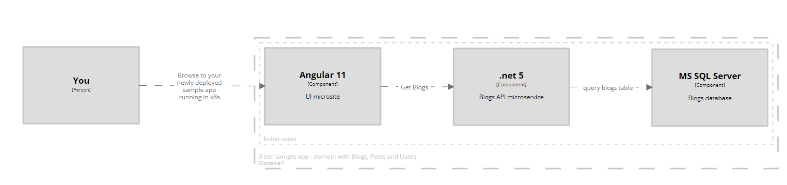

# K8s-App-Vending-Machine (aka KAVM): 

#### Describe an app -> run it locally in k8s -> push it to higher environments

## What does KAVM do?

> :telescope: KAVM is a guide to help you setup a 3-tier application running in k8s on your local machine with flux as the CD tooling (for windows-based developers - steps are tailored for windows terminal) 

### Things to know before you get started 

The CD approach to deploying apps will be done with Flux. Read the [Flux Git-Ops docs](https://toolkit.fluxcd.io/) for some context on what it does. The layout of this repo and approach with flux is described in more detail on [flux's example repo](https://github.com/fluxcd/flux2-kustomize-helm-example). We'll be using [Microk8s](https://microk8s.io/) as the platform to install and manage kuberenetes locally.

### Why use KAVM?

KAVM is an opinionated approach to platform engineering for microservices, providing a consistent way to release apps into higher enivronments, with the aim of reducing the pain as you increase the number of apps you have (in your vending machine) over time.

For more background on how k8s fits into the overall cloud architecture landscape, see the [infoq article: k8s and cloud architectures](https://www.infoq.com/minibooks/kubernetes-cloud-architectures/). See the [benefits section](./documentation/benefits.md) if you want to understand more on the value of using k8s with flux.

## Get Started

Follow the steps below to build out your own kavm platform with this repo. At the end you'll have a sample 3-tiered .net core and angular application running inside of your local k8s environment, with a hands-off mechanism to deploy your apps through your enterprise k8s environments and into production.

The Angular microsite you'll build and deploy:

And the .net 5 API microservice you'll build and deploy:

Run through each section (steps 1-4) to get everything setup locally on your pc:

1. Install and configure Windows Terminal ([Readme](./installation/windows-terminal/README.md))
2. Install microk8s ([Readme](./installation/microk8s/README.md))
3. Install and configure Flux ([Readme](./installation/flux/README.md))
4. Setup the sample api and ui applications ([Readme](./installation/setup-api-and-microsite/sample-3-tier-application-guide.md))

Optionally, if you want to play around with TLS (https) for the sample apps, follow the steps at ([Readme](./installation/setup-api-and-microsite/tls-setup/setup-tls.md))
 
### Local Development

To create a new app, create your app under the `apps` directory and follow the guide on how to ([setup flux to deploy your app](./documentation/setup-flux-to-deploy-your-app.md))

### Notes

If you're not on windows this guide won't be applicable in places. But most should work since powershell core is cross-platform.
