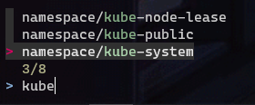
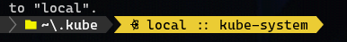

# Install k8s locally with microk8s

## Windows setup guide

### Pre-reqs

1. WSL Enabled
    * If you don't already have wsl on your windows machine, follow the manual steps listed in this microsoft guide to install WSL: <https://docs.microsoft.com/en-us/windows/wsl/install-win10>
2. Install Docker for Windows, download from: <https://docs.docker.com/docker-for-windows/install/>
3. VSCode
4. Jq. To install, run `choco install jq` (assuming you have chocolatey installed already)

### Install kubectl

1. Install guide here: <https://kubernetes.io/docs/tasks/tools/install-kubectl-windows/>
    * If you have chocolatey installed, you can install kubectl via chocolatey with: `choco install kubernetes-cli` (ensure you are running from an admin terminal)
    * If you have already installed kubectl and want to upgrade it: `choco upgrade kubernetes-cli`

### Install Microk8s

1. Download and run the installer for microk8s, installer found here: <https://microk8s.io/>
    * When it prompts you asking if you want to create the vm now, click *no*! We're going to manually create the vm so that we can have your host windows vm bridged into the ubuntu vm that microk8s is running inside of. The reason of doing this is so that we can browse to apps running in microk8s via dns name and the request will be routed correctly.
2. Create a bridge in hyper V and create the microk8s vm with external bridge networking.
    * Open Hyper-V gui, start-> search for Hyper-V Manager
    * Click actions->Virtual Switch Manager (click in the left menu if you don't see that option under actions)
    * Click button 'Create Virtual Switch', type external.
    * Name the v-switch something, i.e. `bridge-win-mk8s`
    * Select your main network adapter and click ok to create it.
    * Next, create a new vm using multipass: `multipass launch --name microk8s-vm --cpus 4 --mem 8G --disk 50G --network bridge-win-mk8s` (ensure network name matches the name you specified in the previous step. You can specify less cpus or less memory depending on your system specs. N.B You could also look at k3s or minikube as an alternative to using microk8s)
    * In the tasktray, click on multipass and click microk8s-vm->open shell to get a shell into the ubuntu image. Then, install microk8s on the ubuntu image with: `sudo snap install microk8s --classic`. (If multipass isn't running, launch the program first).
  
> :raising_hand: The version of microk8s that will be installed in the above command is the `latest/stable` version as specified at <https://microk8s.io/docs/setting-snap-channel> (note that it's not always going to be the latest microk8s or the latest released k8s version)

1. Import the microk8s kubectl configuration into your window's profile:
    * If you haven't used kubectl previously on your local, then first create the `.kube` folder: `cd ~ && mkdir .kube`
    * To copy the config across (if you don't have any existing kube configs setup): `microk8s config > config`
    * If you have already configured other Kubernetes clusters, you should merge the output from the microk8s config with the existing config (copy the output, omitting the first two lines, and paste it onto the end of the existing config using a text editor). see: https://microk8s.io/docs/working-with-kubectl
2. Back in windows terminal, check that microk8s is started and running by: `microk8s status --wait-ready`; it should show *microk8s is running*
3. Install these microk8s addons: `microk8s enable dns ingress hostpath-storage helm observability`. Then add a load balancer called MetalLB: `microk8s enable metallb:192.168.1.230-192.230-192.168.1.250`
4. Rename the default context name that microk8s created in your ~/kube/config file to 'local': `kubectl config rename-context microk8s local` 
5. Run `kubectl config use-context local` to select it as the active.
    * Run a `kubectl get nodes` to make sure you get a `STATUS` of `Ready`, if its `Not Ready` give it ~2 mins
    * Next let's make sure the core system pods are up and running, `kubectl get pods --all-namespaces`, we want to see that everything is 1/1 ready, as above, if anything is 0/1 give it a couple mins and try again;
    * At this stage you ought to be able to interact with the k8s instance. `kubectl get all -A`.

> :warning: If you see output saying it can't connect, likely the kubeconfig values are pointing to and old setup of microk8s, so import again (step 5 and 6): 
> ``` 
> ❯  kubectl get nodes 
> Unable to connect to the server: dial tcp 172.21.246.13:16443: connectex: A connection attempt failed because the connected party did not properly respond after a period of time, or established connection failed because connected host has failed to respond.
> ```

8. Setup kubectl autocomplete to boost your productivity.
    * Install this powershell package: <https://www.powershellgallery.com/packages/PSKubectlCompletion/1.0.4>
    * Import this package everytime you start a powershell shell. Add the following to your $profile:

        ```powershell
        Import-Module PSKubectlCompletion
        Set-Alias k -Value kubectl
        Register-KubectlCompletion
        ```

    * To use kubectl autocomplete, hit `tab` after typing kubectl to see a list of commands.
    * oh-my-posh has a concept called segments that allows customization of the prompt in powershell. First, export your current posh theme so we can customize it: `Export-PoshTheme -FilePath ~/.oh-my-posh-custom-theme.omp.json -Format json` and then paste the [kubectl segement](https://ohmyposh.dev/docs/kubectl/) into the `"segments"` list and update your profile to load your custom theme file: `Set-PoshPrompt -Theme ~/.oh-my-posh-custom-theme.omp.json`
    * Next, we'll setup your powershell to make it easier to switch contexts and namespaces.
        * Install fzf `choco install fzf && Install-Module -Scope CurrentUser PSFzf`
        * Paste [these function snippets](https://medium.com/dataseries/handy-kubernetes-context-namespace-switcher-for-powershell-a432ff8ae7cd) into your profile. To use the kubens function, `kubens`, which will show a list of namespaces that you can pick from:
  
            

            Which will update your current namespace and show it in the prompt:

            

## Validate this repo

You can check the correctness of  the yaml resource files. If you're on windows, you will need to run this script in a WSL terminal as it's a bash script that runs a docker container. See [Readme](../windows-terminal/README.md)

>:star2: Make sure docker desktop is running

```shell
usage:
./validate.sh [local,dev,test,staging,production] #environments are passed in as arguments. If you only want local; [local]

examples:
./validate.sh dev test
./validate.sh local

```

This script will;

* lint the yaml files using `yamllint`
* kustomize validation
  
## Troubleshooting

* kubectl just hangs and doesn't do anything?
  * At the moment microk8s is installing via multipass with a dynamic ip that gets changed when you restart your machine. Fix coming for this in the future (possibly we'll launch (create) the microk8s vm on a static lan ip if it's possible). For now, you need to re-import your kube config:
  
    ```powershell
    cd ~ && cd .\.kube\
    microk8s config > config
    ```

## Resetting your microk8s env

* If you want to reset microk8s so that it's back to a fresh install and will remove everything in the node and start again: `microk8s reset --destroy-storage`

* To delete the VM that runs microk8s, you can issue the following commands:

    ```shell
    multipass delete microk8s-vm
    multipass purge
    ```

    Alternatively, you can open hyper-v console and delete the vm instance through the ui.
